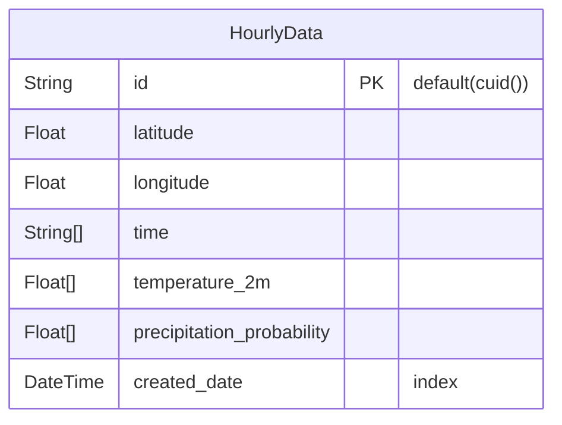

# 天気予報確認アプリ

## 機能
- 現在地から天気確認
- 住所から天気確認
## 非機能
- 定期的な古いDB上のデータクリーンアップ

## 使用技術
### フロント
- Next.js
- Typescript
  
### バックエンド
- prisma
- PostgreSQL
- vercel(deploy/storage)
  
### 使用API
- Google Map API
- Geolonia 住所データ
  - https://geolonia.github.io/japanese-addresses/

### ER図
