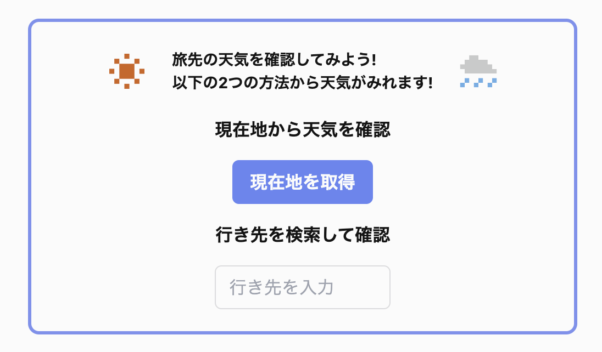

# 天気確認アプリ

https://weather-app-nine-kappa-50.vercel.app/
## ホーム画面

## 天気確認画面

## 機能
- 現在地から天気確認
- 住所から天気確認
## 非機能
- DB上の古いデータの定期的な削除

## 使用技術
### フロントエンド
- Next.js
- TypeScript
  
### バックエンド
- Prisma
- PostgreSQL
- Vercel（デプロイ/ストレージ/Cronジョブ）

### 使用API
- Geolonia 住所データ
  - https://geolonia.github.io/japanese-addresses/
- Open-Metro 天気データ
  - https://open-meteo.com/
- Google Map API

### ER図
