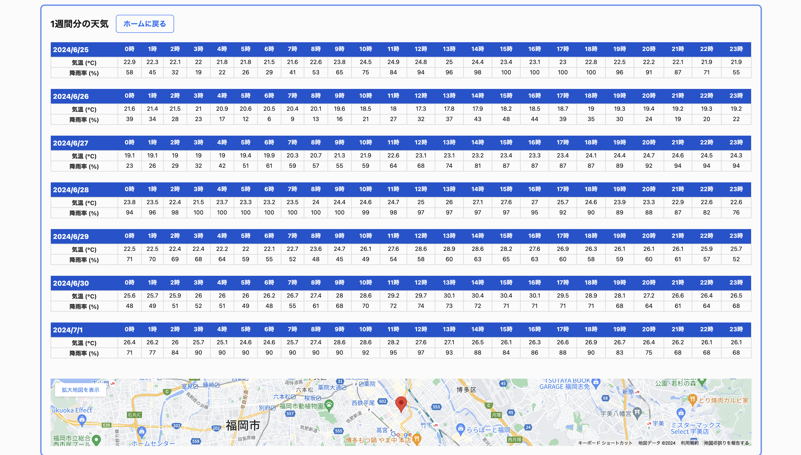

# 天気確認アプリ

|ホーム画面|
|:-:|
||

|天気確認画面|
|:-:|
||

## デプロイ先
https://weather-app-nine-kappa-50.vercel.app/

## 仕様
- 地域を選択すると、天気がわかるサービス
- 取得した天気情報はDBに格納して、同じ日の同一地域の天気情報はDBから取得
- 旅行に行く人が、現地の天気を確認する目的で利用

## 機能一覧
- 機能
  - 現在地から天気確認
  - 行き先から天気確認
- 非機能
  - DB上の古いデータの定期的な削除

## 使用技術
- フロントエンド
  - Next.js
  - TypeScript
  
- バックエンド
  - Prisma
  - PostgreSQL
  - Vercel（デプロイ/ストレージ/Cronジョブ）

- 使用API
  - Open-Metro 天気データ
    - https://open-meteo.com/
  - Google Map API

### DB構成図

- HourlyDataデータ例

